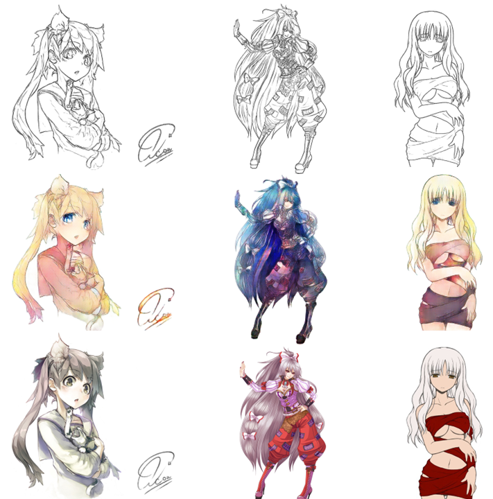

# Pix2Pix
Чиста и простая реализация Pix2Pix с применением таких методов ускорения инференса, как динамическая квантизация, прунинг и смешанная точность.
Полностью соответствует пейперу:https://arxiv.org/abs/1611.07004

## Results
||
|:---:|
||

### Аниме датасет
Ссылка на датасет Kaggle: [link](https://www.kaggle.com/ktaebum/anime-sketch-colorization-pair).

